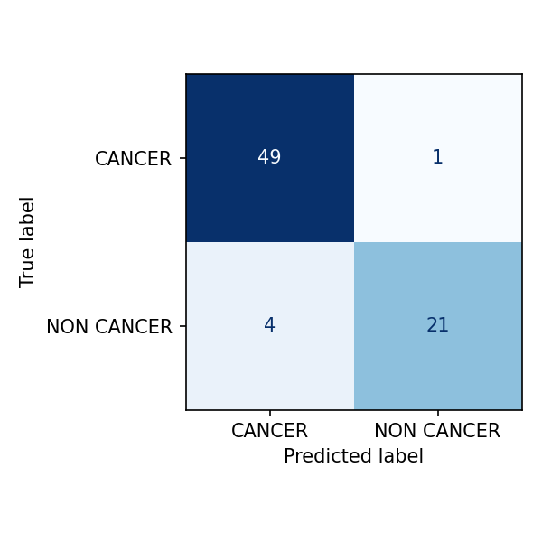
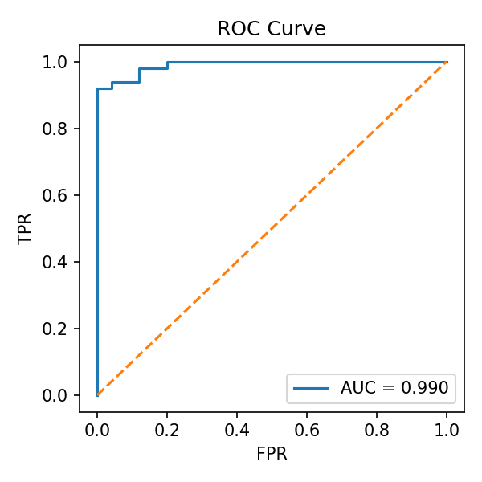

# Oral Cancer Classification (Kaggle)

## Project Overview
A minimal, reproducible portfolio project for oral cancer image classification (binary). It trains a small ResNet-18 baseline on a Kaggle oral-cancer dataset and records results for your resume.

## Dataset and Split
- Dataset: zaidpy/oral-cancer-dataset
- Classes: CANCER / NON CANCER
- Split: 80/10/10 stratified (script: scripts/split_dataset.py)

## Command to Reproduce
    python scripts/train_imagefolder.py --data_dir "data/oral_cancer_split" --epochs 5 --batch_size 32

## Results
- Val Acc = 0.9733
- Test Acc = 0.9333

## Notes
- Transforms: Resize(256) + CenterCrop(224) + RandomHorizontalFlip
- Optimizer: Adam(lr=1e-3)
- Backbone: ResNet18 (pretrained if available)
- Checkpoint: runs/best.pt (auto-saved when validation accuracy improves)

## Training log (last lines)
    Epoch 5: val_acc=0.9733
    >> new best 0.9733
    Test acc: 0.9333
## Figures

